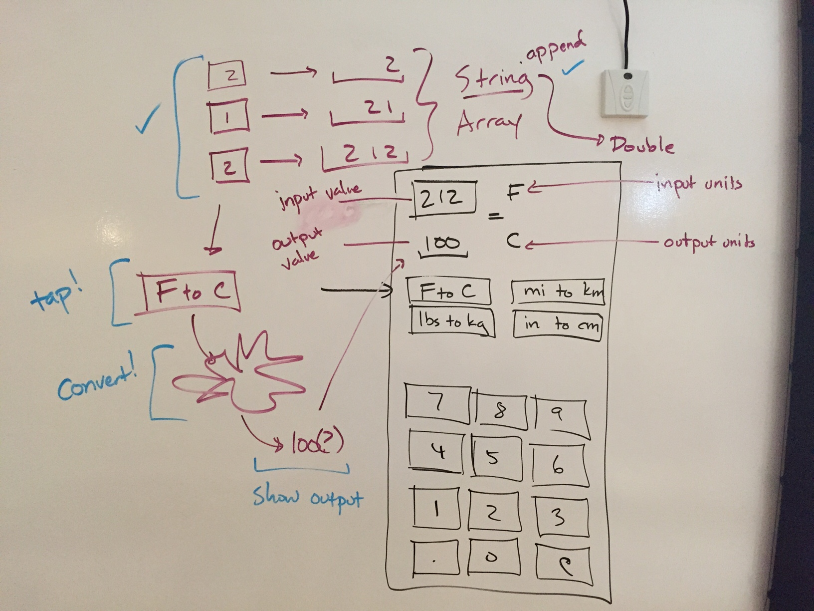
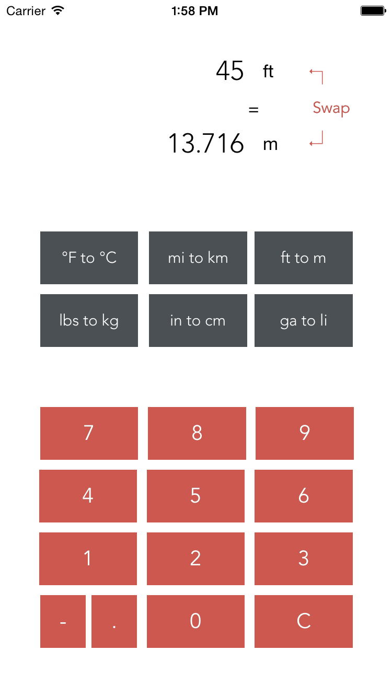

# Lesson 10 - App-Building Workflow

## Learning Objectives

* Walk through how to build an app from the ground up.
* Deploy wireframe sketches to describe desired app behaviors.
* Make use of known data types and structures to enable app behaviors.
* Develop using a critical-path approach to prototyping core functionality.
* Define classes in separate .swift files to empower core functionality.
* Deploy computed properties in classes.

## Lesson Plan

### Computed Properties

* What are computed properties?
* Read-only
* Getters and setters
* Example of computed properties: Compute dog's age from the year it was born.

### Unit conversions app

As an example to build before the midterm that also has a calculator-like UI, similar interaction and thought process, so students can see an app being built from simple reasoning in a wireframe to what they know about data structures and Interface Builder.

The app itself will look like this:

* Build UI
    * Labels for input and output
    * Labels for units
    * Buttons for digits, dot, and clearing
    * Buttons for conversions
* Create a property for current state of user input.
* Draw wireframe of the app with desired interactions.
* What data structure is required for the input interaction?
* Hook up the buttons to a single IBAction.
* Write pseudocode for how that IBAction should work.
* Flesh out the function, adding the typed digit to the inputValue.
* Create a Conversion class for the core app logic
    * Conversion methods (metricToImperial, imperialToMetric)
    * Units as strings
    * Explain that we're working with a class because it makes sense to bundle information together in a single place, like the imperial units, metric units, formulas for imperial-to-metric and metric-to-imperial, and organize them with a consistent "class interface."
* Create subclasses for individual conversions:
    * Inches to centimeters
    * Pounds to kilograms
    * F to C
    * Miles to kilometers
    * Gallons to liters
    * Feet to meters
* Hook up the conversions buttons.
* Write a stub IBAction for a single conversion.
* Continuing in critical-path methodology, write just the logic for that one IBAction.
* Take the inputValue, convert using the appropriate Conversion subclass, then update the UILabel containing the output.
* Emphasize the need for consistent naming: inputValue, outputValue, inputValueLabel, outputValueLabel, etc.
* Getting ready to expand the code
    * Mention the DRY (Don't Repeat Yourself) principle and the following methods for avoiding repetitive code.
    * Go back and create a computed property for the inputValue.
    * Use functions to break down the IBAction for that single conversion so it can be easily applied to other Conversions.
* After, students will complete the functionality of the app.

